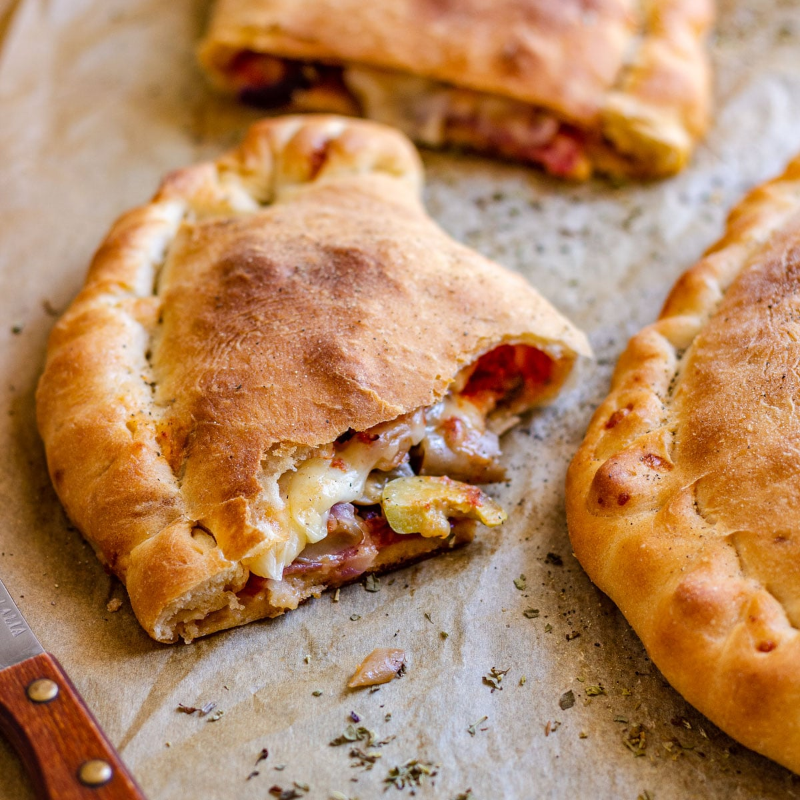
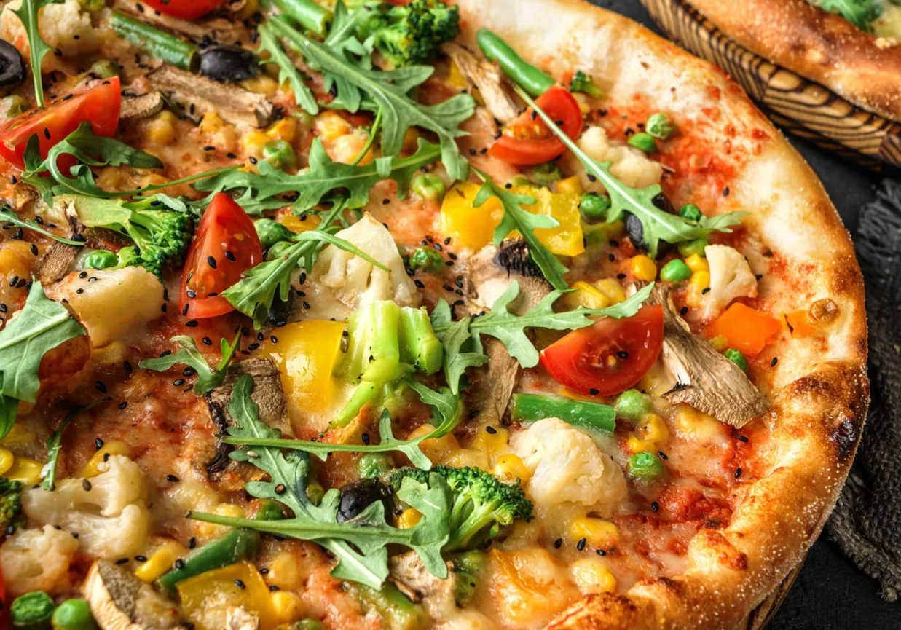
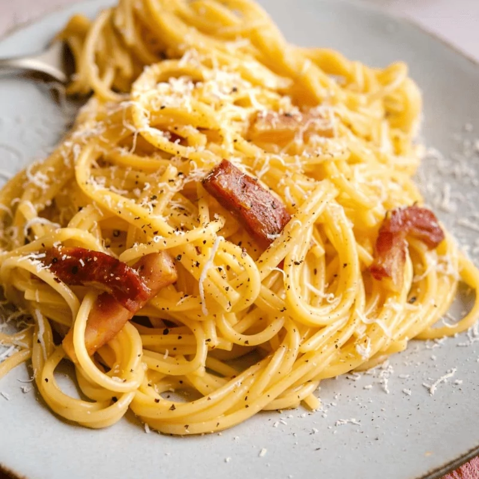
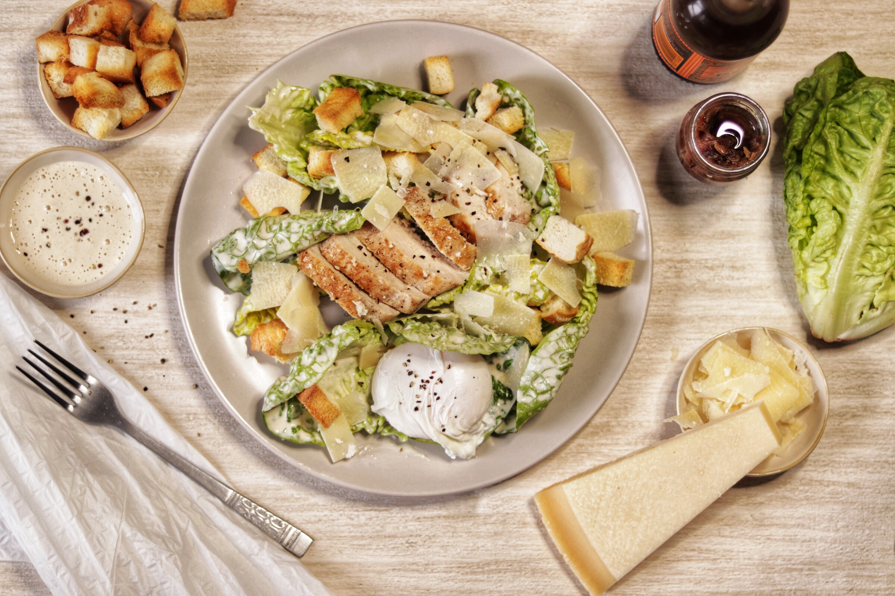
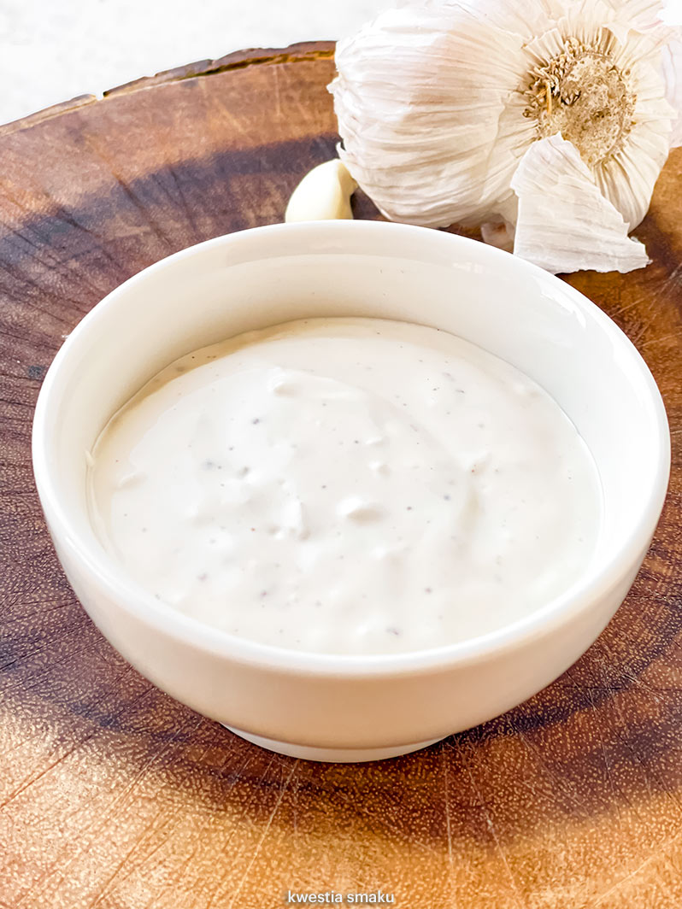
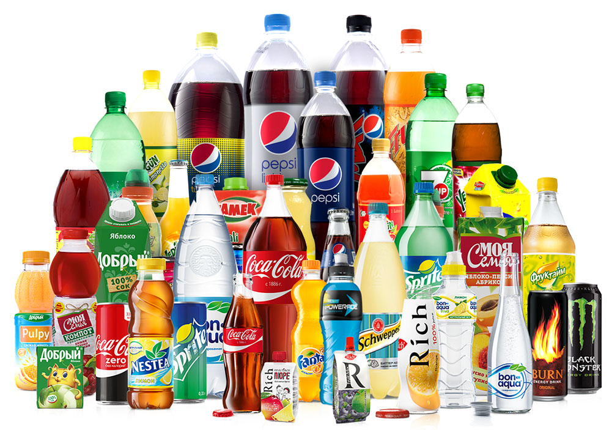

# Menu

## Klasyczne

|Lp.|Pizza:                                                                        |Rozmiar: |30cm  | 40cm | 60cm |
|---|------------------------------------------------------------------------------|---------|------|------|------|
|1. |Margherita (sos pomidorowy, ser, oregano)                                     |         |[20zł]|[40zł]|[50zł}|
|2. |Fungi (sos pomidorowy, ser, pieczarki)                                        |         |[22zł]|[42zł]|[52zł]|
|3. |Salami (sos pomidorowy, ser, salami)                                          |         |[24zł]|[44zł]|[54zł]|   
|4. |Vesuvio (sos pomidorowy, podwójny ser, szynka)                                |         |[23zł]|[43zł]|[53zł]|
|5. |Carbonara (sos śmietanowy, ser mozarella, boczek, jajko)                      |         |[28zł]|[48zł]|[58zł]|
|6. |Kebab (sos pomidorowy, sos czosnkowy, ser, kebab)                             |         |[26zł]|[46zł]|[56zł]|
|7. |Barbeque (sos pomidorowy, ser, kurczak, boczek, cebula, sos barbeque, oregano)|         |[27zł]|[47zł]|[57zł]|
|8. |Grecka (sos pomidorowy, ser, oliwki, feta, sałata lodowa)                     |         |[21zł]|[41zł]|[51zł]|

## Calzone (zawinięte w pieróg)

|Lp.|Nazwa:                                                                        |Rozmiar: |30cm  | 40cm | 60cm |
|---|------------------------------------------------------------------------------|---------|------|------|------|
|1. |Kebab (sos pomidorowy, sos czosnkowy, ser, kebab)                             |         |[26zł]|[46zł]|[56zł]|
|2. |Grecka (sos pomidorowy, ser, oliwki, feta, sałata lodowa)                     |         |[21zł]|[41zł]|[51zł]|
|3. |Barbeque (sos pomidorowy, ser, kurczak, boczek, cebula, sos barbeque, oregano)|         |[27zł]|[47zł]|[57zł]|

## Pizze Wegetariańskie

|Lp.|Nazwa:                                                                        |Rozmiar: |30cm  | 40cm | 60cm |
|---|------------------------------------------------------------------------------|---------|------|------|------|
|1. |Margherita (sos pomidorowy, ser, oregano)                                     |         |[20zł]|[40zł]|[50zł}|
|2. |Fungi (sos pomidorowy, ser, pieczarki)                                        |         |[22zł]|[42zł]|[52zł]|
|3. |Hawajska Vege (sos pomidorowy, ser, ananas)                                   |         |[27zł]|[47zł]|[57zł]|
|4. |Milano Vege (sos pomidorowy, ser, papryka, oregano)                           |         |[26zł]|[46zł]|[56zł]|
|5. |Grecka (sos pomidorowy, ser, oliwki, feta, sałata lodowa)                     |         |[21zł]|[41zł]|[51zł]|

## Makarony

|Lp.|Nazwa:                                                                        |Porcja : |500g  |650g  |
|---|------------------------------------------------------------------------------|---------|------|------|
|1. |Spaghetti Napoli (makaron z sosem pomidorowyn i serem)                        |         |[30zł]|[50zł]|
|2. |Spaghetti Bolonia (makaron z sosem bolońskim)                                 |         |[20zł]|[46zł]|
|3. |Spaghetti Carbonara (makaron z sosem carbonara)                               |         |[28zł]|[48zł]|

## Sałatki

|Lp.|Nazwa:                                                                        |Porcja : |
|---|------------------------------------------------------------------------------|---------|
|1. |Cezar (sałata, cebula, oliwa z oliwek, pomidor                                |[15zł]   |
|2. |Grecka (sałata, cebula, oliwa z oliwek, pomidor, oliwki, feta                 |[20zł]   |
|3. |Spaghetti Carbonara (makaron z sosem carbonara)                               |[25zł]   |

## Sosy

1. Czosnkowy - 5zł
2. Pomidorowy - 5zł
3. Barbeque - 5zł
4. Sezamowy - 5zł
5. Majonezowy - 5zł

## Napoje

|Lp.|Nazwa:                                                                        |Pojemność: |350ml  |500ml |
|---|------------------------------------------------------------------------------|-----------|-------|------|
|1. |Woda                                                                          |           |[5zł]  |[10zł]|
|2. |Sok pomarańczowy                                                              |           |[7zł]  |[12zł]|
|3. |Sok jabłkowy                                                                  |           |[7zł]  |[12zł]|
|4. |Piwo jasne                                                                    |           |[10zł] |[15zł]|
|5. |Piwo ciemne                                                                   |           |[12zł] |[17zł]|
